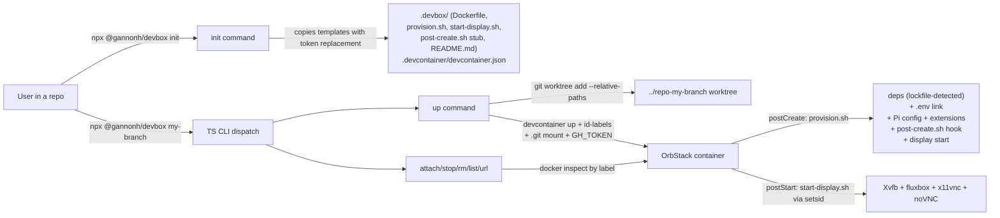

# @gannonh/devbox npm package

## Status
Draft

## Goal

Take the devbox tooling proven in `kata-agents` (one-command isolated worktree
containers with a headed display, Pi agent, Chromium/OAuth, and GitHub-token
forwarding) and publish it as a reusable npm package under the `@gannonh`
scope. The primary entry point is `npx @gannonh/devbox init`, which scaffolds
the config files into any repo, after which `npx @gannonh/devbox <branch>`
boots isolated per-worktree dev containers.

The source of truth for the working behavior is the existing implementation in
`kata-agents` at `/Volumes/EVO/dev/kata-agents`:
- `scripts/devbox.sh` (launcher)
- `.devbox/Dockerfile`, `.devbox/provision.sh`, `.devbox/start-display.sh`
- `.devcontainer/devcontainer.json`

## Source of truth and references

- Existing launcher: `/Volumes/EVO/dev/kata-agents/scripts/devbox.sh`
- Existing Dockerfile: `/Volumes/EVO/dev/kata-agents/.devbox/Dockerfile`
- Existing provision: `/Volumes/EVO/dev/kata-agents/.devbox/provision.sh`
- Existing display stack: `/Volumes/EVO/dev/kata-agents/.devbox/start-display.sh`
- Existing devcontainer config: `/Volumes/EVO/dev/kata-agents/.devcontainer/devcontainer.json`
- Existing runbook: `/Volumes/EVO/dev/kata-agents/docs/reference/devbox.md`

## Current state

Verified working in `kata-agents` (commits through `95227741`):

- `devbox.sh` drives `devcontainer up` against a per-worktree folder, tags
  containers with `devbox.branch` / `devbox.repo` labels for lifecycle
  management, and supports `up`/`--attach`/`--stop`/`--rm`/`--list`/`--url`/
  `--open`.
- Worktree creation uses `--relative-paths` so the `.git` pointer resolves
  inside the container; the main repo's `.git` is bind-mounted at
  `/<repo>/.git` (read-write) so commits work in the box.
- `devcontainer.json` mounts `DEVBOX_ENV` (the repo `.env`) read-only to
  `/home/node/.env` and `~/.pi` read-only to `/tmp/host-pi`; sets
  `DISPLAY=:99`, noVNC/VNC ports, and `KATA_ELECTRON_NO_SANDBOX=1`.
- `provision.sh` runs `bun install` / `pnpm install` / `npm ci` based on
  lockfile, runs Kata-specific `ensure:electron`, links `.env`, copies `~/.pi`
  (excluding sessions/npm/cache) and replays extensions via
  `pi install <spec> --approve`, and starts the display stack via `setsid`.
- `start-display.sh` idempotently brings up Xvfb/fluxbox/x11vnc/noVNC.
- GitHub token is pulled from host `gh auth token` and persisted to
  `/etc/profile.d/gh-token.sh` (node:node, mode 600) so every shell is authed.
- Chromium 149 is installed with `/usr/bin/chromium` wrapped to pass
  `--no-sandbox --disable-gpu --test-type`; `BROWSER=chromium` routes
  `xdg-open` to it, enabling in-box OAuth (`localhost:1455` callback reachable
  in the shared network namespace).
- Display stack survives lifecycle teardown via `setsid`.

What does not exist yet: a standalone package, a TypeScript CLI, an `init`
scaffolder, generic (non-Kata) provisioning, multi-agent provision blocks,
or a publish workflow.

## Constraints

- **Local containers only.** OrbStack 2.2.1 is the Docker runtime; cloud
  deployment is explicitly deferred.
- **No secrets baked into the image.** `.env`, `GH_TOKEN`, and Pi auth flow
  through runtime mounts/env, never into the Dockerfile.
- **Tag is the source of truth for releases.** `package.json` version is
  synced to the git tag by CI, not the other way around.
- **Pi's `~/.pi` is large (~1.3GB).** Only config + auth are copied at
  runtime (sessions/npm/cache excluded); extensions replay Linux-native.
- **The launcher is npx-only.** `init` copies config files; it does not write
  a per-repo launcher script. Users run `npx @gannonh/devbox <branch>`.
- **The package is written in TypeScript** (ESM), with a thin Node bin.
- **v1 is parity with the current kata-agents devbox.** No `update` or
  `doctor` commands in v1 (deferred).

## Out of scope

- Cloud deployment (Fly.io or otherwise).
- A `devbox update` command for merging template changes into existing repos.
- A `devbox doctor` prerequisite-check command.
- Prebuilt images on a registry. The Dockerfile is copied by `init` and built
  locally per repo.
- Wiring `devbox` scripts into the target repo's `package.json`.
- Running the first box as part of `init`.

## Architecture



### Package layout

```
@gannonh/devbox
  package.json            # type: module, bin: { devbox: dist/cli.js }
  tsconfig.json
  eslint config
  vitest config
  src/
    cli.ts                # arg parse, dispatch, --help
    commands/
      init.ts             # scaffold .devbox/ + .devcontainer/
      up.ts               # worktree + devcontainer up + GH token + shell
      attach.ts           # re-enter running box
      stop.ts
      rm.ts
      list.ts
      url.ts              # --url / --open
    lib/
      docker.ts           # container lookup by label, name, noVNC URL
      worktree.ts         # branch->path math, --relative-paths add
      env.ts              # DEVBOX_ENV + GH_TOKEN forwarding logic
      display.ts          # OSC 8 hyperlink helper
      log.ts              # info/warn/error/die with color
      shell.ts            # exec helpers (docker, devcontainer, git)
      lockfile.ts         # detect package manager from lockfile
      tokens.ts           # template token replacement
  templates/
    Dockerfile
    provision.sh
    start-display.sh
    post-create.sh        # no-op stub with explanatory comment
    devcontainer.json
    README.md             # the .devbox/README.md init copies
  .github/
    workflows/
      release.yml         # publish on tag + manual dispatch
  tests/
    (vitest specs per lib module + init golden-file test)
```

### Component responsibilities

- **`cli.ts`** — parse argv, route to a command module, render `--help` and
  per-command help. Thin; no business logic.
- **`commands/init.ts`** — resolve `templates/`, copy files into the target
  repo's `.devbox/` and `.devcontainer/`, apply token replacement (repo name
  in `devcontainer.json` `name` field and README). Idempotent: detect
  existing `.devbox/` and prompt or error unless `--force`.
- **`commands/up.ts`** — port of `cmd_up` from `devbox.sh`: worktree creation
  with `--relative-paths`, `devcontainer up` with `--id-label` + `.git` mount
  + `--remote-env GH_TOKEN`, container lookup, GH_TOKEN persistence to
  `/etc/profile.d/gh-token.sh`, ready banner with OSC 8 links, then `exec`
  into `docker exec -it -w /workspace -u node <cid> bash -l`.
- **`commands/attach.ts`** — re-enter a running box (or start a stopped one
  and re-bring the display up via `setsid`).
- **`commands/{stop,rm,list,url}.ts`** — direct ports of the equivalent
  `cmd_*` functions.
- **`lib/docker.ts`** — `containerFor(branch)`, `containerForAll(branch)`,
  `novncUrlFor(cid)`, the label format `devbox.branch=<branch>`.
- **`lib/worktree.ts`** — `branchToPath(branch)`, worktree add/remove with
  `--relative-paths`, branch existence checks.
- **`lib/env.ts`** — resolve `DEVBOX_ENV` (explicit env, else
  `$HOME/dotfiles/repos/<repo>/.env`); resolve `GH_TOKEN` (explicit env, else
  `gh auth token`).
- **`lib/display.ts`** — `hyperlink(url, text)` OSC 8 emitter.
- **`lib/lockfile.ts`** — given a dir, return `bun`/`pnpm`/`npm`/`none` based
  on which lockfile is present.
- **`lib/tokens.ts`** — `replaceTokens(template, { repoName })`.
- **`templates/`** — the actual files `init` copies. Kept as real files so
  `${localEnv:...}` tokens in `devcontainer.json` stay literal (no string
  escaping) and templates are diffable.

### provision.sh design (generic + agent blocks)

The packaged `provision.sh` is generic. Kata-specific steps move into the
opt-in `.devbox/post-create.sh` hook (which `init` writes as a no-op stub).

Sections, in order:

1. **Repo dependencies** — auto-detect from lockfile (`bun.lock` → `bun
   install`, `pnpm-lock.yaml` → `pnpm install --frozen-lockfile`,
   `package-lock.json` → `npm ci`). Skip when `node_modules` is populated.
2. **`.env` link** — link `${HOME}/.env` to `/workspace/.env` if absent.
3. **Agent setup** — three blocks, only one active:
   - **Pi (active default)** — rsync `/tmp/host-pi` to `${HOME}/.pi`
     excluding `agent/sessions/`, `agent/npm/`, `agent/cache/`; replay
     extensions from `settings.json.packages[]` via
     `pi install <spec> --approve`; failing extensions warn, not hard fail.
   - **Claude Code (commented out)** — `npm install -g @anthropic-ai/claude-code`
     (Node 18+, satisfied by base image). Uses Anthropic API by default via
     `ANTHROP_API_KEY`. No config-dir copy. Works for most users out of the
     box.
   - **Codex (commented out)** — `npm install -g @openai/codex`. Auth via
     `OPENAI_API_KEY` or `codex --login` (opens a browser; works in-box via
     Chromium).
4. **Opt-in hook** — if `.devbox/post-create.sh` exists and is executable,
   run it after deps + agent setup. Absent/non-executable → skipped, no error.
5. **Display start** — `setsid bash -c /usr/local/bin/devbox-start-display`.

`devcontainer.json` keeps the `~/.pi` mount active (Pi is the default) with a
comment showing how to remove it when switching to Claude Code or Codex.

### Release workflow design

Two triggers, both producing the same release artifact:

1. **Tag push** (`vX.Y.Z`) — triggers the workflow automatically.
2. **Manual dispatch** (the primary path) — workflow inputs:
   - `version` (string, optional): a full semver like `1.2.0`. If empty,
     bump patch from the last tag.
   - `dry_run` (boolean, default false): run the full pipeline but skip the
     final `npm publish`.

Workflow behavior (both triggers):

- Resolve the target version: explicit input, or patch bump from the last
  `v*` tag.
- Sync `package.json` `version` to the target (CI edits the file; tag is
  source of truth).
- Create/update the git tag `v<version>` and push it (for manual dispatch
  only; tag-push trigger already has the tag).
- Build (`tsc`), run tests, lint.
- `npm publish` (unless `dry_run`).
- On `dry_run`, publish step is skipped and the run summary shows the version
  that would have been published.

`NPM_TOKEN` is stored as a repository secret. Provenance/SLSA is out of scope
for v1.

## Acceptance criteria

1. `npx @gannonh/devbox init` in an empty git repo creates `.devbox/`
   (Dockerfile, provision.sh, start-display.sh, post-create.sh stub,
   README.md) and `.devcontainer/devcontainer.json` without error. Files are
   byte-equivalent to `templates/` modulo token replacement for repo name.
2. `init` is idempotent: detects existing config, prompts before overwriting
   or errors with a `--force` override. No silent clobbering.
3. `npx @gannonh/devbox <branch>` in an init'd repo boots a working box:
   creates the worktree, runs `devcontainer up`, drops the user into a shell
   in `/workspace` as the non-root user. noVNC, Vite, and GitHub-token
   forwarding all work as in kata-agents today.
4. All launcher subcommands work: `--attach` (re-enter running box),
   `--stop` (stop, keep worktree), `--rm` (remove container + worktree +
   branch), `--list` (list boxes with noVNC URLs), `--url`/`--open` (print/
   launch noVNC URL). Identical behavior to the current `scripts/devbox.sh`.
5. Generic provision auto-detects the package manager from the lockfile
   present (`bun.lock` → `bun install`, `pnpm-lock.yaml` →
   `pnpm install --frozen-lockfile`, `package-lock.json` → `npm ci`) and
   skips when `node_modules` is populated.
6. Opt-in hook: if `.devbox/post-create.sh` exists and is executable, the
   generic `provision.sh` runs it after deps install; if absent or not
   executable, it is skipped with no error. The stub `init` writes is a
   no-op with a comment explaining its purpose.
7. `provision.sh` ships with the Pi agent setup as the active default and
   well-commented, commented-out blocks for Claude Code
   (`@anthropic-ai/claude-code`, `ANTHROPIC_API_KEY`) and Codex
   (`@openai/codex`, `OPENAI_API_KEY` or `codex --login`). A user switches
   agents by commenting out Pi and uncommenting their choice. The Pi block
   works identically to kata-agents today (rsync + extension replay; failing
   extensions warn, not hard fail). The Claude Code block uses Claude Code's
   standard defaults. `devcontainer.json` documents the `~/.pi` mount as
   Pi-specific with removal instructions for other agents.
8. Chromium + OAuth path works in the box: `xdg-open <url>` launches Chromium
   with `--no-sandbox --disable-gpu --test-type`; a `localhost:1455`
   callback is reachable from inside the box (same network namespace).
9. Display stack survives lifecycle teardown: after `devcontainer up`
   returns, Xvfb/x11vnc/noVNC are still running (via `setsid`); `--attach`
   after a `--stop`/restart re-brings the display up.
10. CLI type-checks and lints clean (`tsc --noEmit`, `eslint`), and unit
    tests pass (`vitest`) covering at least: worktree path math, lockfile
    detection, OSC 8 link generation, idempotent init, GH token env
    forwarding logic.
11. `npx @gannonh/devbox --help` and per-command help render correctly with
    usage, flags, and examples.
12. Publish flow: pushing a tag `vX.Y.Z` triggers the release workflow, which
    syncs `package.json` version to the tag, builds, and publishes to npm
    under `@gannonh/devbox`. A manual workflow dispatch with a version input
    (or empty for patch bump from last tag) and a dry-run checkbox does the
    same. In both, the git tag is source of truth and `package.json` is
    updated by CI.
13. `npx @gannonh/devbox@latest init` works against the published package
    (post-release smoke test): a fresh repo init'd via the published package
    produces a bootable box per criterion 3.
14. `.devbox/README.md` generated by `init` covers quickstart (the
    one-command boot), prerequisites (docker/OrbStack, `@devcontainers/cli`,
    `gh auth`, optional `~/.pi`), and a per-file rundown (what
    Dockerfile/provision.sh/start-display.sh/post-create.sh/devcontainer.json
    each do). It renders as markdown on GitHub.

## Implementation phases

### Phase 1 — Package scaffold + tooling

- `package.json` (`@gannonh/devbox`, `type: module`, `bin.devbox`,
  `engines.node >=18`, scripts: `build`, `test`, `lint`, `typecheck`).
- `tsconfig.json` (ESM, `target`/`module`/`moduleResolution` for Node 18+).
- ESLint flat config, Vitest config.
- `src/cli.ts` skeleton with dispatch + `--help` (no command bodies yet).
- Acceptance tie-in: criterion 11 (help renders).

### Phase 2 — Templates + init

- Copy `Dockerfile`, `start-display.sh` verbatim from kata-agents into
  `templates/`.
- Write generic `templates/provision.sh` (lockfile detection, agent blocks,
  opt-in hook, display start).
- Write `templates/post-create.sh` stub.
- Write `templates/devcontainer.json` (generic name token, `~/.pi` mount with
  Pi-specific comment).
- Write `templates/README.md`.
- Implement `src/commands/init.ts` + `src/lib/tokens.ts`.
- Acceptance tie-in: criteria 1, 2, 14.

### Phase 3 — Launcher commands

- Implement `src/lib/{docker,worktree,env,display,log,shell,lockfile}.ts`.
- Implement `src/commands/{up,attach,stop,rm,list,url}.ts` as ports of the
  bash `cmd_*` functions.
- Wire dispatch in `src/cli.ts`.
- Acceptance tie-in: criteria 3, 4, 8, 9, 11.

### Phase 4 — Tests

- Vitest specs for each `lib/` module and a golden-file test for `init`
  (snapshot the generated `.devbox/` + `.devcontainer/` tree).
- Acceptance tie-in: criterion 10.

### Phase 5 — Release workflow

- `.github/workflows/release.yml` with tag-push and `workflow_dispatch`
  triggers, version resolution, `package.json` sync, build/test/lint,
  `npm publish`, dry-run support.
- Acceptance tie-in: criterion 12.

### Phase 6 — End-to-end validation

- `npm pack` and install the tarball locally; run `npx @gannonh/devbox init`
  in a throwaway repo; boot a box; verify criteria 3, 8, 9.
- After first real publish: criterion 13 smoke test against the published
  package.

## Sequencing

Phases 1 → 5 are sequential (each builds on the prior). Phase 6 runs after
the package builds and tests green locally; the criterion-13 smoke test
runs only after the first real npm publish. Phase 5 (release workflow) can
be drafted in parallel with Phase 3 since it has no runtime dependency on
the launcher code, but should be finalized after Phase 4 so CI runs against
a tested package.

## Verification

- **Unit**: `vitest` covering `lib/` modules + `init` golden files
  (criterion 10).
- **Type/lint**: `tsc --noEmit` + `eslint` clean (criterion 10).
- **Integration (manual, local)**: `npm pack` → install tarball → `init` in
  a throwaway repo → boot a box → verify noVNC, Vite, GH token, Chromium
  OAuth path, display survival (criteria 3, 8, 9).
- **Subcommand parity**: run each of `up`/`attach`/`stop`/`rm`/`list`/
  `url`/`open` and confirm behavior matches `scripts/devbox.sh` (criterion
  4).
- **Release**: tag-push triggers publish; manual dispatch with empty version
  bumps patch; dry-run skips publish (criterion 12).
- **Post-publish smoke**: `npx @gannonh/devbox@latest init` in a fresh repo
  boots a box (criterion 13).

## Risks and mitigations

- **`devcontainer up` CLI output parsing.** The bash version pipes output
  through `sed`. The TS port should stream stdout/stderr directly and rely
  on the `--id-label` lookup for the container id, not parse CLI text.
  Mitigation: `containerFor(branch)` via `docker ps --filter label=...` is
  the source of truth, unchanged from the bash version.
- **`exec` into a shell from a Node process.** The bash version uses
  `exec docker exec -it ...`. Node has no `exec(2)`; the TS port must spawn
  `docker exec` with inherited stdio and exit with its code, propagating
  signals (SIGINT/SIGTERM) to the child. Mitigation: use
  `child_process.spawn` with `stdio: 'inherit'` and forward signals; exit
  with the child's exit code.
- **Template drift after `init`.** v1 has no `update` command; users who
  `init` now and want later template changes must re-run `init --force` or
  diff manually. Mitigation: document this in `.devbox/README.md`; `update`
  is a deferred v2 feature.
- **Codex `--login` browser flow.** Relies on the in-box Chromium + OAuth
  path (criterion 8). If Codex's redirect differs from Pi's `localhost:1455`
  pattern, the box still has a working browser; the exact callback port is
  Codex's responsibility. Mitigation: the criterion-8 test covers the
  generic `localhost` callback reachability, which is the shared substrate.
- **OrbStack-specific `.orb.local` URLs.** The launcher falls back to
  container IP on non-OrbStack Docker (per the bash version). Mitigation:
  preserve that fallback in `lib/docker.ts`.
- **npm scope/auth.** `@gannonh/devbox` is currently unpublished (404). The
  user is not logged in to npm locally (`E401`). Mitigation: `NPM_TOKEN`
  secret in GitHub; first publish happens via the release workflow, not
  local `npm publish`.

## Build handoff

**Approved scope**: the 14 acceptance criteria above, implemented across the
six phases.

**Non-goals**: cloud deployment, `update`/`doctor` commands, prebuilt
registry images, `package.json` script wiring, running the first box during
`init`.

**Ordered phases**: 1 (scaffold) → 2 (templates + init) → 3 (launcher
commands) → 4 (tests) → 5 (release workflow) → 6 (E2E validation). Phase 5
may be drafted in parallel with 3 but finalized after 4.

**Required verification**: `tsc --noEmit` + `eslint` + `vitest` green;
`npm pack` + local install + `init` + box boot in a throwaway repo; subcommand
parity against `scripts/devbox.sh`; tag-push and manual-dispatch publish
flows.

**Fixtures**: copy the current kata-agents files
(`scripts/devbox.sh`, `.devbox/*`, `.devcontainer/devcontainer.json`) as the
porting reference. The generic `provision.sh` and `templates/README.md` are
new content.

**Risks**: see Risks and mitigations. The highest-risk items are the
`exec`-into-shell port (Node signal handling) and template drift (no
`update` in v1).

**Blocking questions**: none. All design decisions are resolved.
